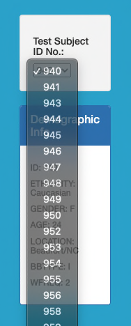
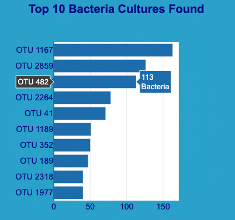
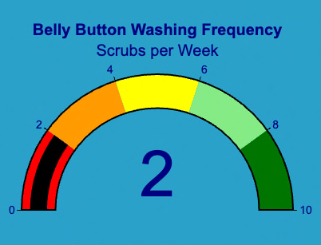
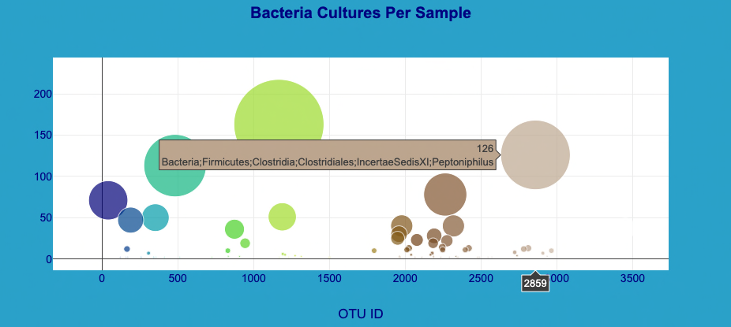

# Belly Button Biodiversity

## Overview

This project uses Javascript and Plotly to chart the biodiversity of bacteria for the participants in the bacteria biodiversity study. The goal of the study is to determine which participants will be best suited for producing synthetic beef.

Different synthetic beef companies will be interested in different type of bacteria to be used as a starter for their unique beef products. The charts provided on this site can be used to narrow down the participants based on which ones have the highest Operational Taxonomic Unit (OTU) count of the bacteria desired.

## Usage

The Biodiversity Dashboard will be populated with the data for the first participant based on their unique ID in the study. The following image shows the menu for selecting the participant:

Once the participant is selected the participants demographic information will be displayed along with the following charts:

- Top 10 Bacteria Cultures Found: this bar chart can be used to determine if the participant has a good OTU number of the specific bacteria requested. Only the top 10 counts are shown to quickly rule out or chose a participant.

    

- Belly Button Washing Frequency (WFRQ): uses a gauge chart the show the WFRQ value for the selected participant. If the WFRQ value is high and the participant still has a decent OTU count for the bacteria in question they may be a better candidate than someone that has a lower WFRQ value and a similar OTU count.

    

- Bacteria Cultures per Sample: uses a bubble chart to show both the frequency of a particular species of bacteria. The larger the bubble the greater the OTU number will be. Using the hover option, the full list of bacteria found can be seen for any particular bubble as shown in the image below:

    

## Folders/Files

- static: folder containing the following subfolders:
  - css: contains style.css for additional styling of components on the website
  - images: contains all images for the project including screenshots for this readme
  - js: contains charts.js which is the main program and uses the following libraries:
    - Plotly: used for creating dynamic charts
    - D3: used to dynamically populate sections of the html page
    - bootstrap.js: used to make the site responsive and have a consistent look and feel
- index.html: starting page used to display the dashboard presented to the user
- samples.json: data compiled from the study that is used to populate the charts for each participant
